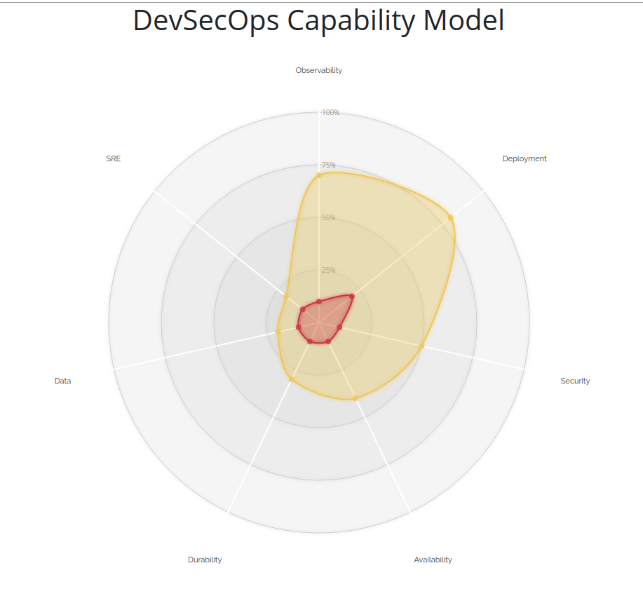

# DevSecOps Capability Model

A simplified capability model for those on a DevSecOps transformation journey.
Fork and use this to map where you are as an organisation are use it to drive where you need to be.



Fork this radar and modify the raw data in `data/tableData.json`.

Deployed using github-pages to [https://devsecops.jujhar.com](), you can publish yours using gh pages too.

## Inspired by

Influenced and inspired by

- [Unicorn Project](https://www.amazon.co.uk/dp/1942788762)
- [Accelerate](https://www.amazon.co.uk/dp/1942788339)
- [Timo Pagel DevSecOps Maturity Model](https://github.com/wurstbrot/DevSecOps-MaturityModel)
- [Maturity models - Fowler](https://martinfowler.com/bliki/MaturityModel.html)

## Local Development

```bash
# to server on localhost:4000 and continuously transpile output
docker run -it --rm \
  -v ${PWD}:/srv/jekyll \
  -p 4000:4000 \
  jekyll/minimal:3.8 \
  jekyll serve --watch

# OPTIONAL use the awesome `reload` which auto-refreshes your browser on change using websockets
# `npm install -g reload`
(cd _site && reload -e "html|js|css|json")
```

## Build and deploy

This site is a [Jekyll static site](https://jekyllrb.com/) and will be auto deployed via Github pages to [](https://devsecops.jujhar.com) upon commit to master.

If you're not publishing to Github pages use this command to one time build assets into `_site` and then publish to a static site bucket or web server.

```bash
# will build into the _site directory
docker run --rm -v \
  ${PWD}:/srv/jekyll \
  jekyll/jekyll \
  jekyll build
```
