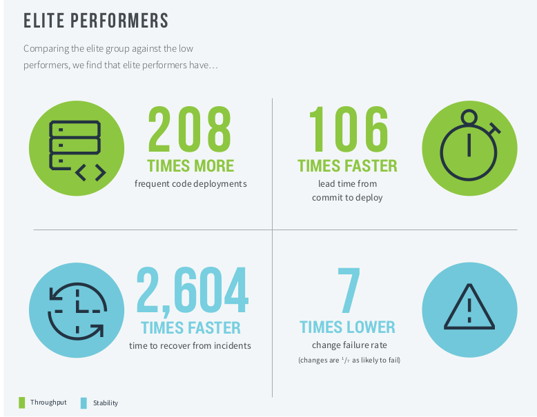

## Why DevOps

Since almost every company today relies on software, software delivery performance is a critical lever that a company has to improve organisational performance.

## How do you improve at DevOps?

As you can see from the image below from the [Google State of DevOps report 2019](https://cloud.google.com/blog/products/devops-sre/the-2019-accelerate-state-of-devops-elite-performance-productivity-and-scaling) it is quite evident how much elite performers (Level 4) perform better than low performers (Level 1)

Use this capability model to map where you are on the DevSecOps journey and then drive and monitor change in maturity.

### How to use

Look at the principles matrix and read the questions, based on your answers to the questions and score yourself for that principle.
Simply fork the project and modify the `data/data.json` and change the team names and scores to model your organisation. Or even add your own principles to model your organisations capability needs.

## Thanks

This capability model was derived, influenced and inspired by:

- [Gene Kim](https://twitter.com/RealGeneKim), [Jez Humble](https://twitter.com/jezhumble) and [Dr. Nicole Forsgren](https://twitter.com/nicolefv) via the publications:
  - [The Unicorn Project](https://www.amazon.co.uk/dp/1942788762)
  - [Accelerate](https://www.amazon.co.uk/dp/1942788339)
  - [Google State of DevOps report 2019](https://cloud.google.com/blog/products/devops-sre/the-2019-accelerate-state-of-devops-elite-performance-productivity-and-scaling)
- [Making Matrixed Organizations Successful with DevOps](https://itrevolution.com/forum-paper-downloads/)
- [Modernizing IT Operations in the Age of DevOps](https://itrevolution.com/forum-paper-downloads/)
- [DevOps Automated Governance Reference Architecture ](https://itrevolution.com/forum-paper-downloads/)
- [Steve Yegge's Platform Rant 2011](https://gist.github.com/jezhumble/a8b3cbb4ea20139582fa8ffc9d791fb2)

Thanks to [Timo Pagel](https://github.com/wurstbrot) for the [DevSecOps maturity project](https://dsomm.timo-pagel.de/index.php) which was the original stimulus for this project.

Props to [Nadieh Bremer](http://bl.ocks.org/nbremer/21746a9668ffdf6d8242) for the original Radar [d3.js](https://d3js.org/) radar code.

## Observability Strategy

First published by Jujhar in March 2019

## DevSecOps

Why the **Sec** in Dev**Sec**Ops? For the last two years the industry has been pushing to shift elements of security (in particular AppSec and CloudSec ) as left as possible. It turns out that DevOps enfranchised teams are well placed to do this work.

## Licence

[MIT](/LICENSE.md) So go [fill your boots](https://dictionary.cambridge.org/dictionary/english/fill-your-boots).
